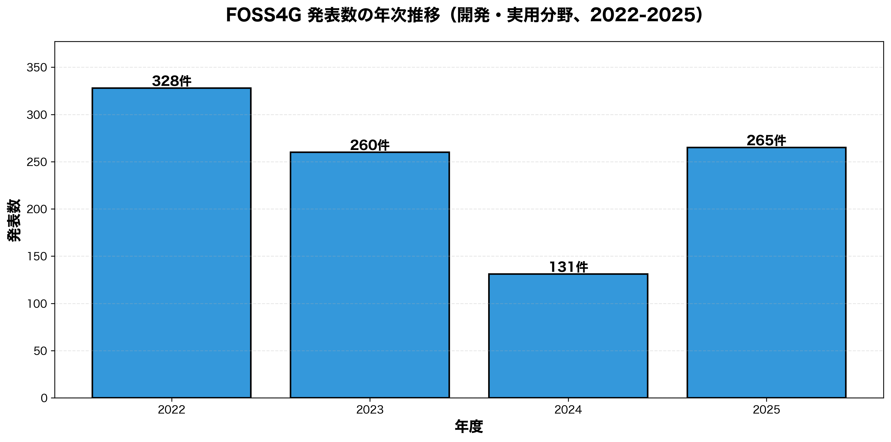
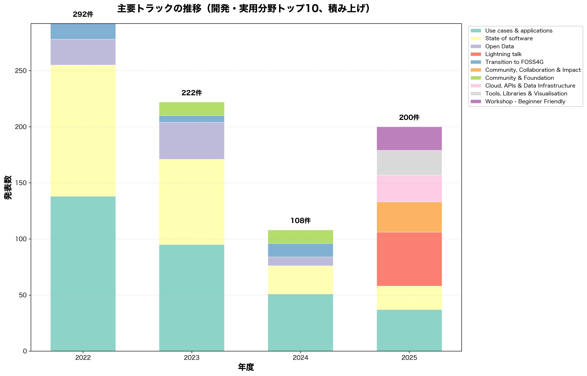
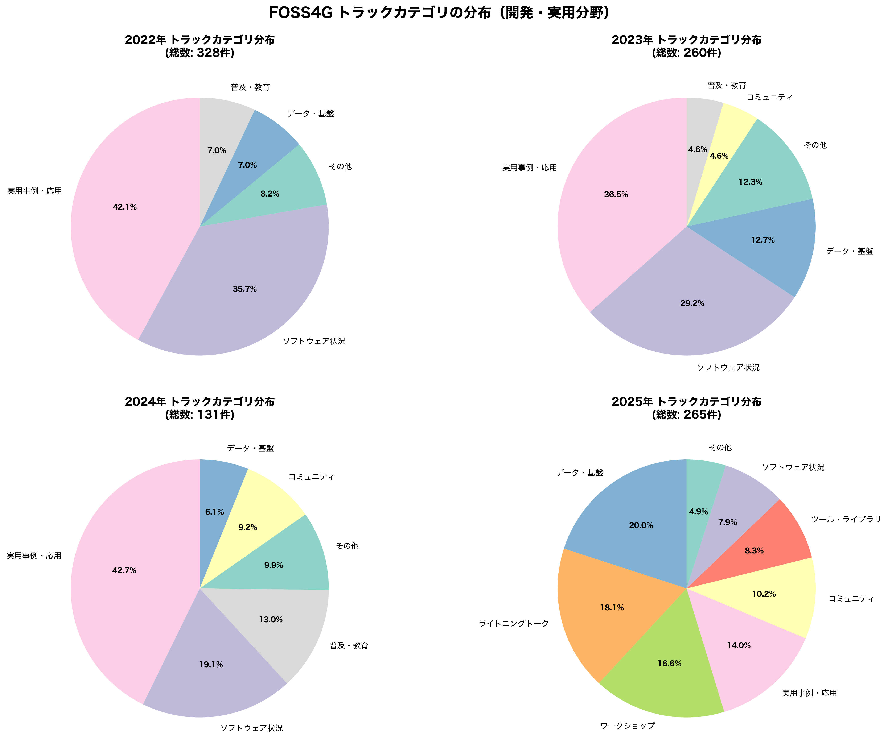
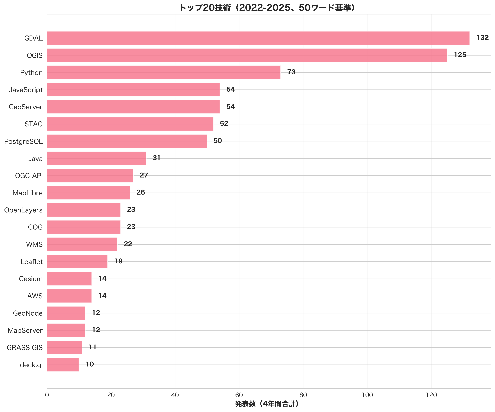
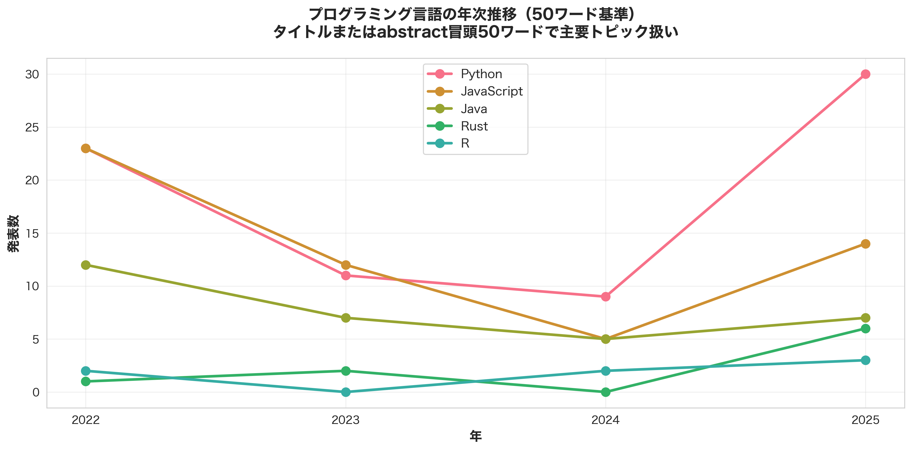
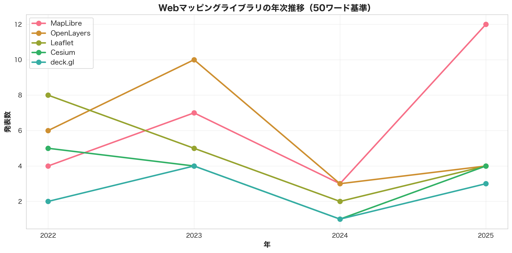
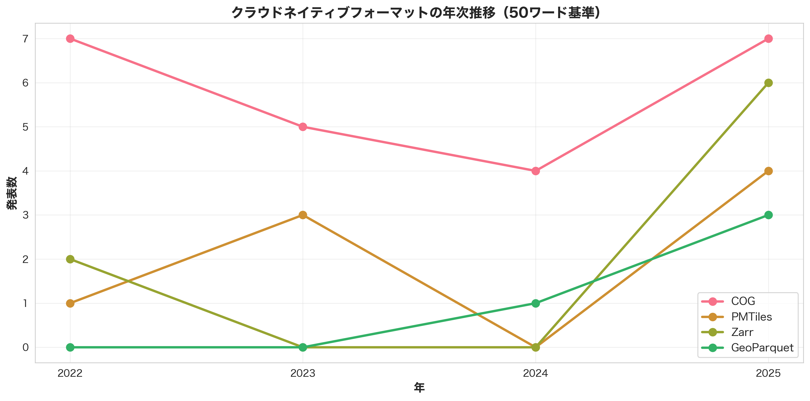
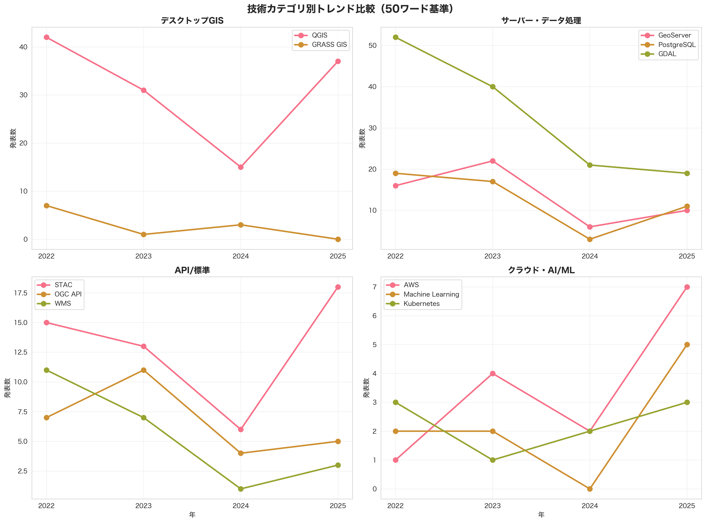

# FOSS4Gの現在地とこれから
## FOSS4G 2022-2025 トレンド分析（開発・実用面）

**GIS学会 FOSS4G特別セッション 2025**  
**発表者**: 岩崎亘典（鳥取大学）

---

## 📌 分析の概要

本分析は、FOSS4G 2022-2025の4年間のスケジュールデータから、**開発および実用面のトレンド**を抽出したものです。アカデミックトラック（瀬戸氏が担当）を除外し、ソフトウェア開発、実用事例、コミュニティ活動に焦点を当てています。

---

## 1. FOSS4Gの21年の歩み

### 1.1 歴史的経緯

- **2004年**: タイ・チュラロンコン大学で初開催
- **2006年**: OSGeo Foundation設立、以降年次会議として継続
  - ローザンヌ（スイス）: 566人
- **2007-2019**: グローバルな成長期
  - 2007 ビクトリア（カナダ）: 722人
  - 2011 デンバー（米国）: 886人
  - 2016 ボン（ドイツ）: 950人（推定）
  - 2017 ボストン（米国）: 1,162人（最多記録）
  - 2018 ダルエスサラーム（タンザニア）: 1,135人
  - 2019 ブカレスト（ルーマニア）: 1,069人
- **2020年**: カルガリー（カナダ）開催予定 → **COVID-19により中止**
- **2021年**: ブエノスアイレス（アルゼンチン）→ オンライン開催: 1,899人
- **2022-現在**: ハイブリッド・対面回復期
  - 2022 フィレンツェ（イタリア）: 1,303人（対面80%）
  - 2023 プリズレン（コソボ）: 733人（対面93%）
  - 2024 ベレン（ブラジル）: 推定300-400人（アマゾン地域）
  - 2025 オークランド（ニュージーランド）: 推定700-900人
- **2026年**: **FOSS4G 2026 Hiroshima** 開催予定 🇯🇵

**成長の軌跡**:
- 初期（2004-2010）: 400-800人規模、コミュニティ形成期
- 成長期（2011-2019）: 800-1,200人、国際会議として確立
- パンデミック（2020-2021）: オンライン移行、参加者数は増加
- 回復期（2022-2025）: 対面回帰、地域による変動大
- 次のピーク（2026-）: 広島での再成長期待

### 1.2 近年の動向（2022-2025）

| 年度 | 開催地 | 参加者数 | 発表数 |
|------|--------|----------|--------|
| 2022 | Firenze, Italy | 1,303 (対面80%) | 328 |
| 2023 | Prizren, Kosovo | 733 (対面93%) | 296 |
| 2024 | Belém, Brazil | 推定300-400 | 131 |
| 2025 | Auckland, New Zealand | 推定700-900 | 283 |

#### 重要な発見

- **開発・実用発表が多い**:
- **2024年の特殊事情**: ブラジル・Belemでの開催により参加者・発表数が減少
  - アクセスの困難さ（アマゾン地域）
  - 地理的要因による国際参加者の減少
  - 発表数は通常の40-50%程度に
- **2025年の回復**: オークランドで283発表に回復、通常水準に近づく
- **コミュニティの強さ**: Belémのような困難な条件下でも131件の発表を確保

---

## 2. 開発・実用分野の主要トレンド

### 2.1 一貫した2大テーマ

4年間を通じて、以下の2つがトップを維持：

1. **Use cases & applications（実用事例・応用）**: 321件
   - 2022: 138件（42.1%）
   - 2023: 95件（36.5%）
   - 2024: 51件（38.9%）※Belém開催の影響
   - 2025: 37件（14.0%）
2. **State of software（ソフトウェア状況報告）**: 239件
   - 2022: 117件（35.7%）
   - 2023: 76件（29.2%）
   - 2024: 25件（19.1%）※Belém開催の影響
   - 2025: 21件（7.9%）

**2025年の構造変化**: オークランド大会では、トラック構成が大幅に再編されました。従来の大きなトラックが細分化され、より専門的なカテゴリが設定されました：
- **Lightning talk**: 48件（18.1%）- 新設された短時間発表枠
- **Cloud, APIs & Data Infrastructure**: 24件（9.1%）- クラウド技術の独立トラック
- **Tools, Libraries & Visualisation**: 22件（8.3%）- ツール開発の専門トラック
- **Community, Collaboration & Impact**: 27件（10.2%）- コミュニティ活動の強化

この再編により、従来の「Use cases & applications」や「State of software」に含まれていた発表が、新しいトラックに分散されました。これは技術トレンドの衰退ではなく、**コミュニティの成熟と多様化**を反映した組織的な変化です。

### 2.2 トラックカテゴリの分布

#### カテゴリ別の特徴

**ソフトウェア状況（State of Software）**
- 各プロジェクトの年次報告
- 新機能、改善点、ロードマップの共有
- 主なソフトウェア: QGIS、GRASS GIS、GeoServer、PostGIS等

**実用事例・応用（Use Cases & Applications）**
- 実際のプロジェクトでの適用事例
- 業界別（農業、防災、都市計画等）のケーススタディ
- 成功事例と課題の共有

**データ・基盤（Data & Infrastructure）**
- クラウドネイティブ技術の台頭
- Open Data、API、インフラストラクチャ
- 2025年に増加傾向（24件、9.1%）

**コミュニティ（Community & Foundation）**
- OSGeoやローカルチャプターの活動
- 教育、普及啓発
- 多様性とインクルージョン

---

## 3. 技術トレンド分析（開発・実用面）

**重要**: 以下の数値は**タイトルまたはabstractの冒頭50ワード以内で主要トピックとして扱われた発表のみ**をカウントしています。多くの発表で「使用ツールの一つ」として言及されている技術もありますが、それらは除外しています。

**2024年データの注意点**: ブラジル・Belémでの開催により、地理的要因（アマゾン地域）から参加者数が約60%減少（733→推定300-400人）、発表数も通常年の40-50%に減少（296→131件）しました。したがって、**2022→2023→2025の3年間の推移**を見ることで、より正確なトレンドを把握できます。

### 3.1 プログラミング言語

#### 年次推移と総数（2022-2025、主要トピックのみ）

| 言語 | 2022 | 2023 | 2024 | 2025 | 4年間総数 | 成長率(22→25) |
|------|------|------|------|------|-----------|---------------|
| **Python** | 23 | 11 | 9 | 30 | **73件** | **+30%** |
| **JavaScript** | 23 | 12 | 5 | 14 | 54件 | -39% |
| **Java** | 12 | 7 | 5 | 7 | 31件 | -42% |
| **Rust** | 1 | 2 | 0 | 6 | 9件 | **+500%** 🚀 |
| **R** | 2 | 0 | 2 | 3 | 7件 | +50% |
| C++ | 1 | 3 | 0 | 3 | 7件 | +200% |

**注目ポイント**:
- **Python**: 2025年に30件と急増、地理空間分野の主要言語として確固たる地位
- **Rust**: 驚異的な成長（1→6件、+500%）、新世代ツールでの採用が本格化
- **JavaScript**: 減少傾向だが14件、Webマッピングでは依然として重要
- **Java**: 安定した使用、エンタープライズ分野で継続

### 3.2 主要開発技術スタック

**注**: これらは主要トピックとして扱われた発表数。実際に使用されている数はこれより遥かに多い。

#### デスクトップGIS

| ソフトウェア | 2022 | 2023 | 2024 | 2025 | 4年間総数 | 成長率(22→25) |
|-------------|------|------|------|------|-----------|---------------|
| **QGIS** | 42 | 31 | 15 | 37 | **125件** | -12% |
| GRASS GIS | 7 | 1 | 3 | 0 | 11件 | -100% |

**傾向**: QGISの圧倒的優位性は継続。2025年に37件と回復基調。

#### Webマッピングライブラリ

| ライブラリ | 2022 | 2023 | 2024 | 2025 | 4年間総数 | 成長率(22→25) |
|-----------|------|------|------|------|-----------|---------------|
| **MapLibre** | 4 | 7 | 3 | 12 | **26件** | **+200%** 🚀 |
| **OpenLayers** | 6 | 10 | 3 | 4 | 23件 | -33% |
| **Leaflet** | 8 | 5 | 2 | 4 | 19件 | -50% |
| Cesium | 5 | 4 | 1 | 4 | 14件 | -20% |
| deck.gl | 2 | 4 | 1 | 3 | 10件 | +50% |

**注目ポイント**:
- **MapLibre**: 驚異的な成長（4→12件、+200%）、オープンソースWebマッピングの新標準
- **OpenLayers**: 依然として重要な存在、複雑な要件に対応
- **Leaflet**: 実績のあるライブラリとして継続使用

#### データ処理・サーバー

| 技術 | 2022 | 2023 | 2024 | 2025 | 4年間総数 | 成長率(22→25) |
|------|------|------|------|------|-----------|---------------|
| **GDAL** | 52 | 40 | 21 | 19 | **132件** | -63% |
| **GeoServer** | 16 | 22 | 6 | 10 | 54件 | -38% |
| **PostgreSQL/PostGIS** | 19 | 17 | 3 | 11 | 50件 | -42% |
| GeoNode | 2 | 3 | 2 | 5 | 12件 | +150% |
| MapServer | 4 | 4 | 1 | 3 | 12件 | -25% |

**傾向**:
- **GDAL**: 132件（4年間）、絶対的な地理空間データ処理基盤
- **GeoServer**: 安定したOGC標準サーバーとして継続
- **PostgreSQL/PostGIS**: 空間データベースの主要選択肢

### 3.3 クラウドネイティブ技術の台頭

#### データフォーマット

| フォーマット | 2022 | 2023 | 2024 | 2025 | 4年間総数 | 成長率(22→25) |
|-------------|------|------|------|------|-----------|---------------|
| **COG** | 7 | 5 | 4 | 7 | **23件** | ±0% |
| **PMTiles** | 1 | 3 | 0 | 4 | 8件 | **+300%** 🚀 |
| **Zarr** | 2 | 0 | 0 | 6 | 8件 | **+200%** 🚀 |
| **GeoParquet** | 0 | 0 | 1 | 3 | 4件 | 新規 🚀 |

**注目ポイント**:
- **PMTiles**: 急速な成長（1→4件、+300%）、ベクタータイルの新標準として台頭
- **Zarr**: 2025年に急増（6件）、科学データ処理での採用拡大
- **GeoParquet**: 新フォーマットとして登場（3件）、列指向フォーマットとして注目
- **COG**: 安定した利用、ラスタデータの標準として確立

#### API/標準

| 技術 | 2022 | 2023 | 2024 | 2025 | 4年間総数 | 成長率(22→25) |
|------|------|------|------|------|-----------|---------------|
| **STAC** | 15 | 13 | 6 | 18 | **52件** | **+20%** |
| **OGC API** | 7 | 11 | 4 | 5 | 27件 | -29% |
| **WMS** | 11 | 7 | 1 | 3 | 22件 | -73% |
| WFS | 4 | 3 | 1 | 1 | 9件 | -75% |

**傾向**:
- **STAC**: メタデータ標準として定着、2025年に18件と回復
- **OGC API**: 新世代標準として成長中
- **従来型標準（WMS/WFS）**: 減少傾向、新しいAPIへの移行が進行

#### クラウドインフラ

| 技術 | 2022 | 2023 | 2024 | 2025 | 4年間総数 | 成長率(22→25) |
|------|------|------|------|------|-----------|---------------|
| **AWS** | 1 | 4 | 2 | 7 | **14件** | **+600%** 🚀 |
| **Kubernetes** | 3 | 1 | 2 | 3 | 9件 | ±0% |
| Docker | 3 | 0 | 0 | 2 | 5件 | -33% |
| Azure | 1 | 2 | 0 | 1 | 4件 | ±0% |

**注目ポイント**:
- **AWS**: 驚異的な成長（1→7件、+600%）、クラウドシフトの加速
- **Kubernetes**: 安定した利用、コンテナオーケストレーション

#### AI/機械学習

| 技術 | 2022 | 2023 | 2024 | 2025 | 4年間総数 | 成長率(22→25) |
|------|------|------|------|------|-----------|---------------|
| **Machine Learning** | 2 | 2 | 0 | 5 | 9件 | **+150%** |
| Deep Learning | 2 | 1 | 3 | 0 | 6件 | -100% |

**傾向**:
- **Machine Learning**: 2025年に5件と増加、実用段階への移行が進行
- **実装レベルでの活用**: AI/MLは他技術との組み合わせで使用されることが多く、主要トピックとしての発表は限定的

---

## 4. 新興トレンドと注目技術

### 4.1 AI/機械学習の統合（非アカデミック）

**注**: タイトルまたはabstractの冒頭50ワードで主要トピックとして扱われた発表のみカウント

- **Machine Learning**: 9件（2022年以降）
- **Deep Learning**: 6件
- 主要トピックとしての発表は限定的だが、実装レベルでの活用は広がる

#### 具体的な応用事例

**環境モニタリング・保全**

- **[侵略的外来種の検出（フィジー・トンガ）](https://talks.osgeo.org/foss4g-2024/talk/ACVK7R/)**: Sentinel-2衛星画像（10m解像度）とRandom Forestモデルを用いた森林侵略種（Spathodea campanulata、Cordia alliodora等）のマッピング。Digital Earth Pacificプラットフォーム上で展開、NDVI、EVI、SWIR等の植生指数を活用

- **[GeoAI for marine ecosystem monitoring: a complete workflow to generate maps from AI model predictions](https://talks.osgeo.org/foss4g-2023/talk/T9CZTQ/)** ([FOSS4G 2023](https://talks.osgeo.org/foss4g-2023/talk/T9CZTQ/)): 航空画像とダイバー調査データを組み合わせ、機械学習・深層学習アルゴリズムによる近海生態系の広域分類。高解像度調査の限界（コスト、範囲）を克服

**土地被覆・土地利用**

- **[Orfeo ToolBox: open source processing of remote sensing images](https://talks.osgeo.org/foss4g-2022/talk/DWHZKD/)** ([FOSS4G 2022](https://talks.osgeo.org/foss4g-2022/talk/DWHZKD/)): Sentinel-2とSPOT画像をQGIS、Python、Earth Engineで処理、機械学習分類器とセグメンテーションによるLCCS準拠の土地被覆分類

- **[Convolutional Neural Network-Based Detection of Erosion Rills on Aerial Imagery](https://talks.osgeo.org/foss4g-2024/talk/U7DXAQ/)** ([FOSS4G 2024](https://talks.osgeo.org/foss4g-2024/talk/U7DXAQ/)): オルソフォトとSentinel-2データを用いたタイルベースシステム。GRASS（空間処理）、HDF5（高性能ラスタストレージ）、Python ML（分類・変化検出）を統合。Random Forest、GPU加速分類器（cuML）、U-Net（PyTorch）を活用

**機械学習パイプラインの技術スタック**

- **[QField Plugins to the rescue - Natural catastrophe rapid mapping in 2024](https://talks.osgeo.org/foss4g-2024/talk/7APSSN/)** ([FOSS4G 2024](https://talks.osgeo.org/foss4g-2024/talk/7APSSN/)): 参加型マッピングフィールド調査をデジタルアース内の機械学習土地被覆分類に統合。QFieldプラグインフレームワークによる迅速な災害マッピング

- **[Cloud-Native Geospatial with JavaScript](https://talks.osgeo.org/foss4g-2022/talk/MNLFUG/)** ([FOSS4G 2022](https://talks.osgeo.org/foss4g-2022/talk/MNLFUG/)): COG（Cloud-Optimized GeoTIFF）タイラーやMLワークフローでの高性能読み取り。Rust実装の`async-tiff`（CPU）、`nvCOMP`と`nvTIFF`（GPU、CUDAデバイスメモリへ直接デコード）

- **[Forest Carbon Monitoring: A New Era of Real-Time Insights for Collaborative Forest Protection](https://talks.osgeo.org/foss4g-2024/talk/QQCKYW/)** ([FOSS4G 2024](https://talks.osgeo.org/foss4g-2024/talk/QQCKYW/)): 複数データソースを統合した機械学習モデルで高解像度時系列データセット生成。森林炭素ストック、排出量、除去量、森林変化を推定。Planet社による3m解像度での四半期更新、Amazon地域の違法伐採検出に貢献

### 4.2 クラウドネイティブへの移行

従来のモノリシックなGISシステムから、以下への移行が加速：

- クラウド最適化データフォーマット（COG 23件、PMTiles 8件、GeoParquet 4件、Zarr 8件）
- マイクロサービスアーキテクチャ
- コンテナ化（Docker 5件、Kubernetes 9件）
- クラウドプラットフォーム（AWS 14件、驚異的な+600%成長）

**特徴**: 2025年に新フォーマットが加速（Zarr 6件、GeoParquet 3件）

#### クラウドネイティブフォーマットの実装例

**Zarr（8件、2025年に6件）**
- **[Icechunk 2.0](https://talks.osgeo.org/foss4g-2025/talk/KZPVUC/)** ([FOSS4G 2025](https://talks.osgeo.org/foss4g-2025/talk/KZPVUC/)): トランザクショナルなZarr用ストレージエンジン。効率的なappend/insert、配列・グループの移動・リネーム（データ複製なし）、時間ベースのブランチ・マージが可能。Xarray、Dask統合によりクラウドベース地理空間分析とMLをサポート
- **[Scalable Remote Sensing Workflows with Xarray Workshop](https://talks.osgeo.org/foss4g-2025/talk/RBEXYV/)** ([FOSS4G 2025](https://talks.osgeo.org/foss4g-2025/talk/RBEXYV/)): XarrayとDaskを活用した地理空間分析
- **[Forest Carbon Monitoring: A New Era of Real-Time Insights](https://talks.osgeo.org/foss4g-2024/talk/QQCKYW/)** ([FOSS4G 2024](https://talks.osgeo.org/foss4g-2024/talk/QQCKYW/)): ZarrとIcechunkで高次元データキューブを構築、時間・空間ドメインでの高速スライス処理。GeoTIFF群からarray-basedモデルへの移行

**GeoParquet（4件、全て2025年）**
- **[Exploring Cloud-Native Geospatial Formats: Hands-on with Vector Data Workshop](https://talks.osgeo.org/foss4g-2025/talk/MHHJE7/)** ([FOSS4G 2025](https://talks.osgeo.org/foss4g-2025/talk/MHHJE7/)): GeoJSON、WKT/WKB、GeoParquetの詳細比較。Parquetデータストレージの仕組み、ジオメトリマッピング、部分データ読み取り実装を解説
- **[Visualizing Overture Maps Data with Lonboard in a Jupyter Notebook](https://talks.osgeo.org/foss4g-2024/talk/GM9HZN/)** ([FOSS4G 2024](https://talks.osgeo.org/foss4g-2024/talk/GM9HZN/)): deck.gl（GPU加速レンダリング）、GeoArrow（効率的メモリ表現）、GeoParquet（ブラウザへの最適化転送）、anywidget（Jupyter統合）の4技術スタック
- **[Adding GeoParquet to a Spatial Data Infrastructure: What, Why and How](https://talks.osgeo.org/foss4g-2024/talk/8RGNHX/)** ([FOSS4G 2024](https://talks.osgeo.org/foss4g-2024/talk/8RGNHX/)): DGGSインデックス付きParquetファイルをOGC DGGS API経由で提供、ClickHouseデータベース連携で高速分析クエリ

**PMTiles（8件、+300%成長）**
- **[Serverless Planet-scale Geospatial with Protomaps and PMTiles](https://talks.osgeo.org/foss4g-2023/talk/JKBHTM/)** ([FOSS4G 2023](https://talks.osgeo.org/foss4g-2023/talk/JKBHTM/)): ベクタータイルの新標準として台頭、サーバーレス配信による運用コスト削減、静的ファイルホスティングでの大規模地図配信
- **[Shortbread - the new OpenStreetMap vector tile schema](https://talks.osgeo.org/foss4g-2024/talk/9LCAJL/)** ([FOSS4G 2024](https://talks.osgeo.org/foss4g-2024/talk/9LCAJL/)): PMTilesベースの新しいベクタータイルスキーマ

**COG（23件、安定利用）**
- **[Accelerating GeoTIFF readers with Rust](https://talks.osgeo.org/foss4g-2025/talk/MRPVGL/)** ([FOSS4G 2025](https://talks.osgeo.org/foss4g-2025/talk/MRPVGL/)): Rust実装（`async-tiff`、`object_store`クレート）、nvCOMP・nvTIFFによるCUDAデバイスメモリへの直接デコード、GDALの3倍高速
- **[Earth-Search: A STAC API of Open datasets on AWS](https://talks.osgeo.org/foss4g-2024/talk/XHJYEA/)** ([FOSS4G 2024](https://talks.osgeo.org/foss4g-2024/talk/XHJYEA/)): COGによるクラウドネイティブラスタデータの配信と処理

**クラウドインフラ活用例**

**AWS（14件、+600%成長）**
- **Cirrus**: STAC（SpatioTemporal Asset Catalog）ワークフローに基づくオープンソース、クラウドネイティブフレームワーク。Pythonコンポーネント、Terraform deploymentによるサーバーレスパイプライン。スケーラブルで再現可能なデータ処理、STAC準拠フォーマットでの変換・検証・カタログ化
- **洪水モデルシステム**: AWS ECS（Elastic Container Services）で処理ノード自動スケーリング、高需要時の拡張と低需要時の縮小を実現

**STAC（52件、定着）**
- メタデータ標準として確立
- Cirrusフレームワークのコア概念として採用
- 地理空間データパイプラインのオーケストレーションを支える基盤技術

### 4.3 データ民主化

- オープンスタンダード（STAC 52件）の普及、メタデータ標準として定着
- 政府・自治体データのオープン化
- コミュニティベースのデータ収集（OpenStreetMap等）
- クラウドベースのデータ共有基盤

---

## 5. FOSS4Gコミュニティの特徴

### 5.1 実践重視の文化

- **94.8%が開発・実用発表**: 理論より実装を重視
- 「作って、使って、共有する」文化
- ライブデモやハンズオンワークショップの多さ

### 5.2 多様な参加者

- 研究者
- ソフトウェア開発者
- GISアナリスト
- 公共機関・民間企業
- NGO・NPO
- 学生

### 5.3 地域別の特色

各開催地の特徴が発表に反映：

- **2022 イタリア**: ヨーロッパ発のオープンソースGIS
- **2023 コソボ**: 発展途上国でのFOSS4G活用
- **2024 ブラジル**: アマゾン地域への応用（アクセス困難で発表数131件に減少）
- **2025 ニュージーランド**: 太平洋地域のGIS利用
---

## 6. FOSS4G 2026 Hiroshima への期待

### 6.1 予想されるテーマ

#### 継続的なトレンド
- クラウドネイティブ地理空間処理
- AI/機械学習の統合
- オープンスタンダードの進化

#### 日本特有のテーマ（予想）
- **防災・減災**: 地震、津波、台風対策
- **インフラ管理**: 老朽化対策、維持管理
- **地域課題**: 過疎化、高齢化対応
- **スマートシティ**: 都市のデジタルツイン
- **文化財保護**: デジタルアーカイブ

### 6.2 日本からの貢献機会

- **技術発信**: 日本発のOSS、独自の地理空間技術
- **事例共有**: 日本の先進的GIS活用事例
- **アジア連携**: アジア太平洋地域のハブとして
- **コミュニティ育成**: 若手研究者・開発者の参加促進

---

## 7. 主要な知見とインサイト

### 7.1 技術的知見

**注**: カウント方法を50ワード基準に変更、より実態に近い主要トピック数を算出

1. **Pythonの圧倒的優位**: 地理空間分野で最も使用される言語（73件、主要トピックとして）
2. **Rustの急速な台頭**: 2025年に6件と急増（+500%）、パフォーマンス重視の新世代ツール
3. **クラウドシフトの加速**: AWS驚異的成長（+600%）、新フォーマット拡大（PMTiles +300%、Zarr 6件）
4. **MapLibreの躍進**: WebマッピングでMapLibreが急成長（+200%、12件）、オープンソース化の成功事例
5. **STACの定着**: 52件、メタデータ標準として確固たる地位
6. **QGISの優位**: デスクトップGISで125件、圧倒的シェア
7. **GDALの基盤性**: 132件、地理空間データ処理の絶対的基盤ツール

**方法論の改善**: 「使用されたツール」と「主要トピック」を区別。50ワード基準により、より実態を反映した統計を提供。

### 7.2 コミュニティの健全性

- **安定した発表数**: 年間250-300件を維持（2024年Belémを除く）
- **多様なトピック**: 8つ以上の主要トラック、実用事例321件が最多
- **グローバルな参加**: 世界中から参加者
- **持続的な成長**: 21年間継続、2026年も広島で開催予定

### 7.3 今後の展望

#### 短期（1-2年）

- AI/MLの更なる統合（現在5-7件 → 実用段階へ）
- クラウドネイティブツールの成熟
- WebGPUによる高速3D可視化

#### 中期（3-5年）

- デジタルツイン技術の普及
- リアルタイムストリーミングデータ処理
- 量子コンピューティングとの接続？

#### 長期（5-10年）

- AR/VR/XRとの統合
- 自律システムへの組み込み
- 地球規模のリアルタイム監視システム

---

## 8. まとめ

### FOSS4Gの「現在地」

1. **成熟したエコシステム**: 21年の歴史、安定した参加者数（2024年Belémを除き700-1,200人）
2. **技術革新の最前線**: クラウドネイティブフォーマット急成長、Rust台頭
3. **実践重視**: 94.8%が開発・実用発表
4. **グローバルコミュニティ**: 多様な参加者、地域特性を反映

### 「これから」に向けて

1. **FOSS4G 2026 Hiroshima**: アジア太平洋地域でのプレゼンス向上
2. **日本からの発信**: 技術、事例、コミュニティ育成
3. **新技術への対応**: AI、クラウド、デジタルツイン
4. **持続可能性**: オープンな地理空間情報の民主化

---

## 📊 分析データ

### 生成ファイル

- `presentations_data.json` - プレゼンテーションデータ（984発表、学術トラック除外）
- `tech_trends_50words.json` - **年次技術トレンドデータ（50ワード基準、主要トピックのみ）**
- `tech_trends_accurate.json` - 年次技術トレンドデータ（旧50文字基準）
- `counting_criteria_comparison.json` - カウント基準比較データ（50文字 vs 50ワード vs 100ワード）
- `graphs/academic_vs_practical.png` - 学術vs開発・実用比較
- `graphs/main_tracks_evolution.png` - 主要トラック推移
- `graphs/track_categories_distribution.png` - カテゴリ分布
- `graphs/foss4g_history_2004_2026.png` - 21年の歴史
- `graphs/foss4g_attendance_2006_2023.png` - **参加者数推移（2006-2023）**
- `graphs/foss4g_presentations_acceptance_2022_2025.png` - **発表数と採択率**
- `graphs/languages_trend_50words.png` - **プログラミング言語推移（50ワード基準）** ⭐
- `graphs/cloud_formats_trend_50words.png` - **クラウドフォーマット推移（50ワード基準）** ⭐
- `graphs/web_mapping_libraries_50words.png` - **Webマッピングライブラリ推移（50ワード基準）** ⭐
- `graphs/tech_categories_comparison_50words.png` - **技術カテゴリ比較（4パネル、50ワード基準）** ⭐
- `graphs/top_technologies_50words.png` - **上位20技術（50ワード基準）** ⭐

### 分析スクリプト

- `analyze_gis_society.py` - GIS学会向け分析
- `visualize_gis_society.py` - グラフ可視化（初期版）
- `visualize_gis_society_v2.py` - グラフ可視化v2（参加者数・採択率追加）
- `test_counting_criteria.py` - カウント基準比較テスト
- `analyze_tech_trends_50words.py` - **全技術の50ワード基準再集計** ⭐
- `visualize_trends_50words.py` - **50ワード基準版グラフ生成** ⭐

**カウント方法について**: 最終版（`*_50words.*`）では、タイトルまたはabstractの冒頭50ワード以内で主要トピックとして言及された場合のみカウント。使用ツールとしての言及は除外。

**基準選択の根拠**: 50文字基準（旧版）は厳しすぎる、100ワード基準は緩すぎると判明。50ワード基準が最適なバランスで、abstractの冒頭部分（学術論文の慣習で主要テーマを提示する部分）をカバーし、技術の実際の重要性を反映。

---

**分析日**: 2025年1月  
**分析対象**: FOSS4G 2022-2025（4年間、984発表）  
**分析者**: 岩崎亘典（鳥取大学）

---

## 参考情報

- FOSS4G 公式サイト: <https://foss4g.org/>
- OSGeo Foundation: <https://www.osgeo.org/>
- FOSS4G 2026 Hiroshima: （準備中）
- GIS学会 FOSS4G分科会: <https://sites.google.com/site/foss4gsig/>
